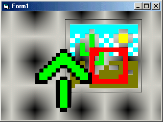



## Advanced Picturebox

### Description

The perfect blend of a picture box and image control, the Advanced Picture Box is a lightweight control that makes applications such as games easier to produce.
 
### More Info
 
Properties:

- PictureFile: Filename of the picture (BMP, GIF, JPG)

- Style: Display style (none, repeat, stretch)

- TransparentColor: Transparent color used (OLE_COLOR)

- SyncTransparentColor: If set to true, transparent color is automatically set to color at point 0,0 of picture

After downloading and unzipping, add it to the components in a new or current project (Project>Components...). Set your properties and go. Feel free to modify the source code (I would appreciate original credit rights, though)

             |
---                |---
**Submitted On**   |2002-07-03 23:28:38
**By**             |[Chris Donalds](https://github.com/Planet-Source-Code/PSCIndex/blob/master/ByAuthor/chris-donalds.md)
**Level**          |Intermediate
**User Rating**    |4.5 (27 globes from 6 users)
**Compatibility**  |VB 4\.0 \(32\-bit\), VB 5\.0, VB 6\.0
**Category**       |[Graphics](https://github.com/Planet-Source-Code/PSCIndex/blob/master/ByCategory/graphics__1-46.md)
**World**          |[Visual Basic](https://github.com/Planet-Source-Code/PSCIndex/blob/master/ByWorld/visual-basic.md)
**Archive File**   |[Advanced\_P103519782002\.zip](https://github.com/Planet-Source-Code/chris-donalds-advanced-picturebox__1-36711/archive/master.zip)

